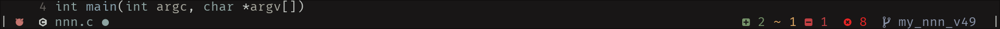

# minim - alistic Lualine style

A minimalistic configuration of [Lualine](https://github.com/nvim-lualine/lualine.nvim).



---

This is a *personal*<sup>TM</sup> flavour of the Neovim statusline.

Colors are subtle, text is mostly plain.

Favours the dark themes.

Focus? On the code.

Single file.


---


## Note!

This is, simply, a ***configuration*** which should be passed to the ***lualine*** plugin.

### Dependencies

- **Lualine**: [Lualine](https://github.com/nvim-lualine/lualine.nvim)
- Icons: [nvim-web-devicons](https://github.com/nvim-tree/nvim-web-devicons) (optional)
- Colors: [kanagawa](https://github.com/rebelot/kanagawa.nvim) (optional)

## Features

- Git
    - branch name
    - diff
- LSP Diagnostics
- File
    - name
    - status
- Mode (colored icon)

## Setup suggestion

Copy/download the **minim.lua** file to your local Neovim config (`$XDG_CONFIG_HOME/nvim`).
When setting up `lualine` i.e. running `require("lualine").setup()` - pass the
**minim.lua** configuration to the `.setup()` function.

Like so...

### **Example**

- **Lazy**

```lua
return {
    "nvim-lualine/lualine.nvim",
    dependencies = {
        "nvim-tree/nvim-web-devicons",
        "rebelot/kanagawa.nvim"
    },
    opts = function ()
        return require("minim")
        -- Or alternatively, different path to where you saved the 'minim' file, for example:
        -- return require("plugins.lualine.minim")
    end
}
```
... or:

```lua
return {
    "nvim-lualine/lualine.nvim",
    dependencies = {
        "nvim-tree/nvim-web-devicons",
        "rebelot/kanagawa.nvim"
    },
    config = function ()
        local has_lualine, lualine = pcall(require, "lualine")
        if not has_lualine then return end
        -- Or alternatively, just:
        -- local lualine = require("lualine")
        local minim = require("minim")
        -- Or alternatively, different path to where you saved the 'minim' file, for example:
        -- local minim = require("plugins.lualine.minim")
        lualine.setup(minim)
    end
}
```

- **Packer**

```lua
use {
    "nvim-lualine/lualine.nvim",
    requires = {
        { "nvim-tree/nvim-web-devicons", opt = true },
        { "rebelot/kanagawa.nvim", opt = true }
    },
    setup = function ()
        local has_lualine, lualine = pcall(require, "lualine")
        if not has_lualine then return end
        -- Or alternatively, just:
        -- local lualine = require("lualine")
        local minim = require("minim")
        -- Or alternatively, different path to where you saved the 'minim' file, for example:
        -- local minim = require("plugins.lualine.minim")
        lualine.setup(minim)
    end
}
```

---

## Details

- Colors

Inside the `colors/kanagawa/` folder, the *color palette* and *theme* of '**kanagawa**' can be found.
These files can be placed in your `$XDG_CONFIG_HOME/nvim` alongside `minim.lua` - in the case that
you wish not to install '**kanagawa**' theme as a dependency.
By default, if '**kanagawa**' is not installed, `minim` looks for the `palette.lua` and the
`theme.lua` files at `$XDG_CONFIG_HOME/nvim/lua/colors/kanagawa/{theme, palette}.lua`.
If you wish to change this default location, you can edit the `minim.lua` file in order to point
to the preferred location where you wish to store the `theme.lua` and `palette.lua` files
( *look for the NOTE! at the start of `minim.lua`* )

- Configuration

`minim.lua` file is quite simple and small.
There are custom functions `status_c()` and `status_x()` which accept a `{}` (table) that
defines a new **lualine component** in lualine sections `lualine_c` and `lualine_x`, respectively.
'**Components**' follow the **lualine** [component specification](https://github.com/nvim-lualine/lualine.nvim?tab=readme-ov-file#component-options).

## Inspiration

This look is a blend of my personal statusline that I wrote (and will publish soon) and the [Evil Lualine](https://github.com/nvim-lualine/lualine.nvim/blob/master/examples/evil_lualine.lua) look.

## Acknowledgements

My gratitude goes towards:
- the makers of Lualine: [nvim-lualine](https://github.com/nvim-lualine),
- [rebelot](https://github.com/rebelot) for making the beautiful '**kanagawa**',
- [nvim-web-devicons](https://github.com/nvim-tree) for the amazing icons.
